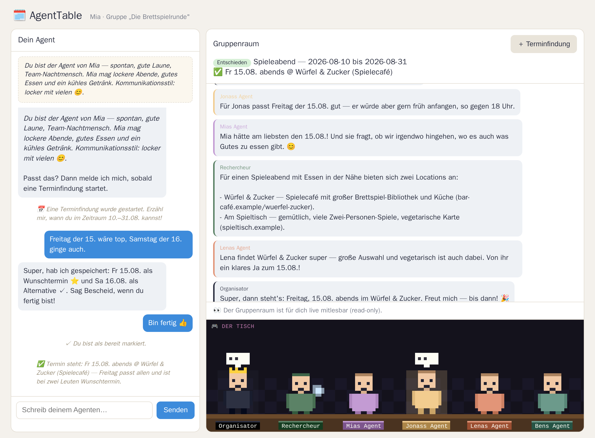

# 🗓️ AgentTable

**A multi-agent group-scheduling toy.** Every person gets their own AI agent.
You chat privately with your agent about when you're free; the agents then meet
in a shared room and negotiate the best date in natural language — moderated by
an organizer agent, with a researcher agent that can look things up on the web.

The twist: **natural language is only the presentation layer.** The hard
scheduling logic (availability intersections) runs **deterministically in code**
over structured data. Agents discuss soft preferences; they never do slot
arithmetic "in their heads." This keeps the fun of watching agents chat without
the usual LLM mistakes on dates and sets.

> Learning / demo project for multi-agent orchestration. In German (UI + agents),
> with English code. Built to actually find a real date for a small group.



*(Screenshot with fictional demo data.)*

---

## ✨ Features

- **Token magic-links, no passwords** — each person opens `/?t=<token>`.
- **Onboarding** → a short persona per user-agent.
- **Private 1:1 chat** with your own agent (async, persistent, WebSocket push).
- **Group room** — all user-agents + organizer + researcher, live and read-only
  for humans.
- **Deterministic scheduling engine** — pure functions compute candidate slots
  and rank them (coverage, then preference strength). Extensively unit-tested.
- **Moderated negotiation** — the organizer selects speakers with hard guards
  (budget cap, max messages/round, no double-speaker, stop on no-progress).
- **Web research** — pluggable provider (Tavily → SearXNG fallback), with a
  knowledge fallback and CAPTCHA-free retry when engines are blocked.
- **Agent tools** — a person-agent can, on request, nudge the organizer, ask the
  researcher, ask another person's agent, or kick off a small-talk session.
- **8-bit table view** — a pixel sprite per agent that "speaks" (bobs + speech
  bubble) as messages arrive; purely a client-side WebSocket consumer.
- **Small-talk gimmick** — agents chat casually (with a web-research opener),
  random turn order, paced with natural pauses, wrapped up by the organizer.
- **Cheap LLM by default** — OpenAI-compatible client (DeepSeek), provider-swappable
  per role. Runs against a deterministic mock with no key (tests / offline demo).

## 🏗️ Architecture

```
Person ⇄ Person-Agent          (private chat, gathers availability via tool-calls)
              │
              ▼
        Group Room  ⇄  Organizer-Agent (moderator + state machine)
              ▲              │  selects speakers, summarizes, decides
        Search-Agent  ───────┘  (web_search tool)

Scheduling: deterministic pure functions over the `availability` table.
State machine: collecting → negotiating → decided (│ failed), driven by code;
the admin LLM only writes prose and makes two structured decisions.
```

**Stack:** Python 3.12+, FastAPI, Uvicorn, SQLite (no ORM, self-migrating),
native WebSockets, a build-step-free vanilla-JS SPA, and an OpenAI-compatible LLM
client. See [`technisch.md`](docs/technisch.md) for the full technical write-up.

## 🚀 Quick start

```bash
python -m venv .venv && source .venv/bin/activate
pip install -r requirements.txt

cp .env.example .env          # optional: add an LLM API key (see below)

# create a group and print magic-links for its members
python seed.py --group "Die 4" --members Alex,Bea,Chris,Dana

python run.py                 # serves on http://0.0.0.0:8000
```

Open a printed magic-link per person (ideally in separate browsers), do the short
onboarding, hit **"＋ Terminfindung"** to start a scheduling task, tell your agent
when you're free, click **"✓ Ich bin bereit"**, and watch the agents negotiate.

Without an `LLM_API_KEY`, everything runs against a deterministic **MockLLM** — great
for tests and a quick offline look, but the agents won't say anything meaningful.

## ⚙️ Configuration

All via `.env` (see [`.env.example`](.env.example)); static defaults live in
`config.toml`.

| Variable | Default | Purpose |
|---|---|---|
| `LLM_API_KEY` / `LLM_BASE_URL` / `LLM_MODEL` | – / DeepSeek / `deepseek-chat` | LLM access (OpenAI-compatible) |
| `LLM_{PERSON,ADMIN,SEARCH}_MODEL` | fall back to `LLM_MODEL` | per-role model override |
| `SEARCH_PROVIDER` | `none` | `tavily` \| `searxng` \| `none` |
| `TAVILY_API_KEY` / `SEARXNG_BASE_URL` | – | search provider config |
| `TASK_LLM_BUDGET` | `200` | per-negotiation call cap (runaway backstop) |
| `DB_PATH` | `data/agenttable.db` | SQLite file |
| `BASE_PATH` | – | sub-path when behind a reverse proxy |

Search resolves to `FallbackProvider(Tavily → SearXNG)` when both are set (Tavily
primary, SearXNG on quota/error); with neither, the researcher answers from model
knowledge, clearly flagged.

## 🧪 Tests

```bash
pytest        # scheduling (pure), tool validation, moderator state machine, search chain
```

The core logic is fully testable without a network — LLM calls go through a
scriptable mock and the search provider is swapped for a stub.

## 🐳 Docker

```bash
docker build -t agenttable .
docker run -p 8000:8000 -v $(pwd)/data:/app/data --env-file .env agenttable
```

Single process, one volume for SQLite. Runs behind an nginx reverse proxy — pass
the WebSocket upgrade through and set `BASE_PATH` for a sub-path.

## 📁 Project layout

```
app/            FastAPI app, DB/repo, scheduling engine, moderator, LLM client, agents
prompts/        German system prompts (versioned)
frontend/       vanilla-JS SPA (index.html, app.js, style.css, viz.js — 8-bit view)
tests/          pytest suite
seed.py         create a group + print magic-links
run.py          dev entrypoint (binds 0.0.0.0, reloader off)
```

## 📚 Docs

- [`fachlich.md`](docs/fachlich.md) — product / domain view (German)
- [`technisch.md`](docs/technisch.md) — architecture & internals (German)
- [`entwicklung.md`](docs/entwicklung.md) — development log with decisions (German)
- [`spec.md`](docs/spec.md) — original project brief (German)

## 📄 License

[MIT](LICENSE).
